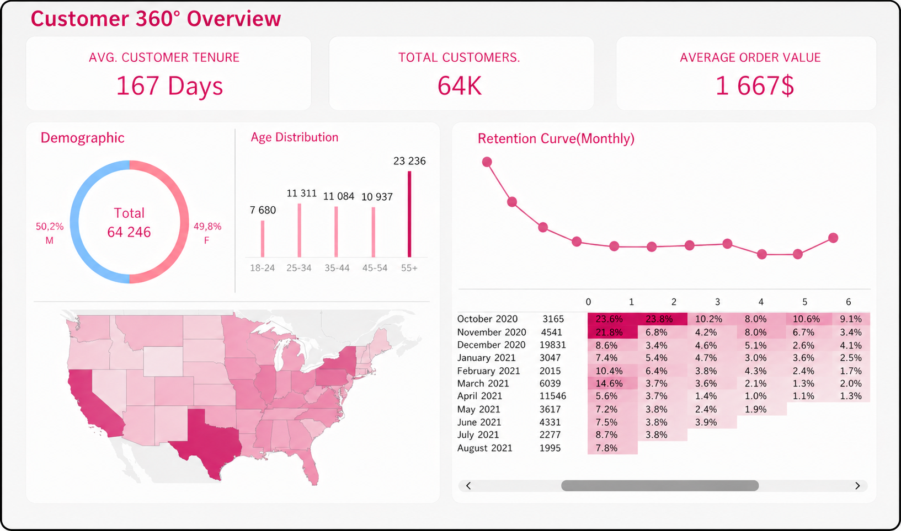
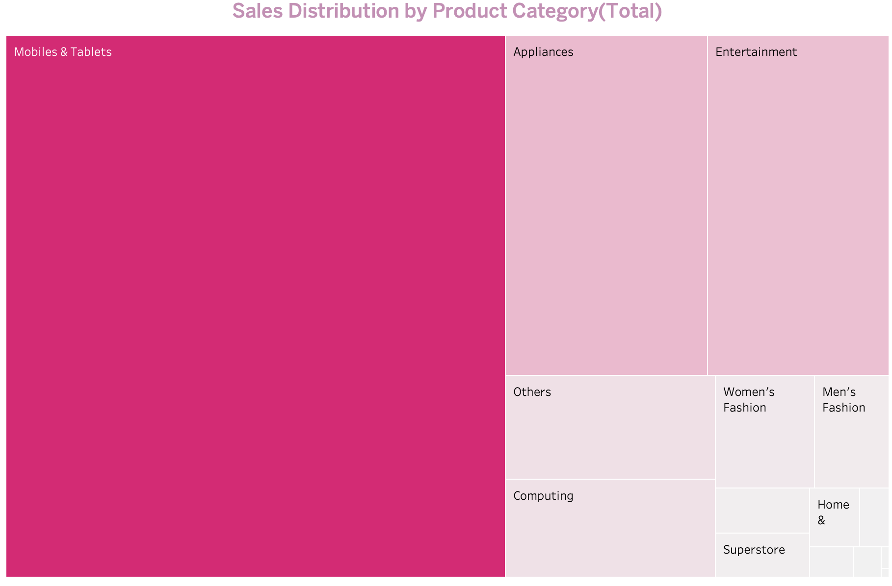
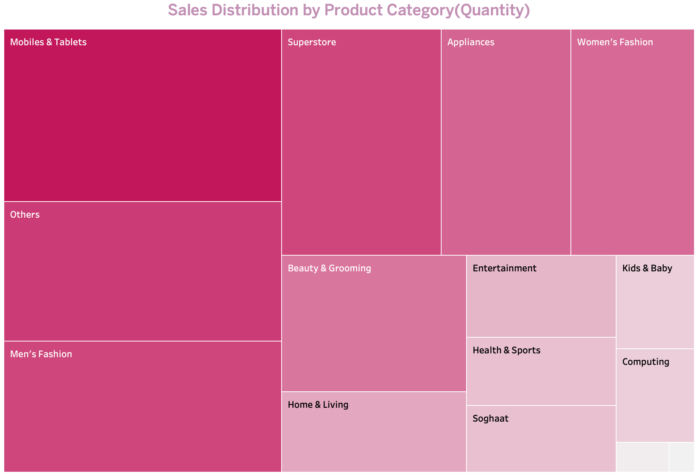

# Customer Analytics Tableau Dashboard

Interactive Tableau dashboard for e-commerce customer analytics. The project explores customer retention, demographics, geography, sales distribution, average order value, and key business metrics to identify customer behavior patterns and revenue drivers.

## Project Overview

This project presents an interactive Tableau dashboard for analyzing e-commerce customer behavior and business performance.

The dashboard combines customer demographics, geographic distribution, retention analysis, product category sales, and key business metrics into one Customer 360° view.

The goal of the project is to identify customer behavior patterns, understand retention dynamics, and highlight the main revenue-driving product categories.

## Business Questions

This dashboard is designed to answer the following business questions:

1. What are the main customer segments by demographics and geography?
2. How does customer retention change over time?
3. Which product categories generate the highest sales?
4. Which product categories have the highest sales volume?
5. What are the key customer-level metrics, such as average order value and customer tenure?

## Dashboard Preview

The dashboard provides a high-level Customer 360° overview, including customer tenure, total customers, average order value, demographics, age distribution, geographic distribution, retention curve, and cohort retention table.

## Key Metrics

The dashboard focuses on the following key metrics:

- **Average Customer Tenure** — shows how long customers stay active.
- **Total Customers** — represents the total number of unique customers in the dataset.
- **Average Order Value** — measures the average revenue generated per order.
- **Retention Rate** — shows how customer activity changes over time.
- **Sales by Product Category** — helps identify the strongest revenue-driving categories.
- **Customer Demographics** — provides insights into gender and age distribution.
  

## Additional Visualizations

### Sales Distribution by Product Category

These treemaps compare product categories by **total sales value** and **quantity sold**.

The analysis shows that **Mobiles & Tablets** is the leading category both by total sales and quantity sold, making it the main revenue and volume driver.

This comparison helps distinguish between categories that generate high revenue and categories that sell in high volume.

## Tools Used

- Tableau
- Google Sheets
- Data visualization
- Dashboard design
- Customer analytics

## Data Source

The project is based on an e-commerce customer dataset containing information about customers, orders, product categories, sales, and customer activity over time.

The data was prepared in Google Sheets and visualized in Tableau.
